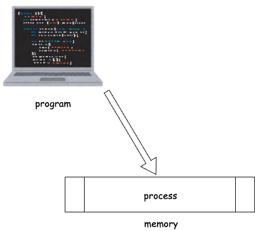
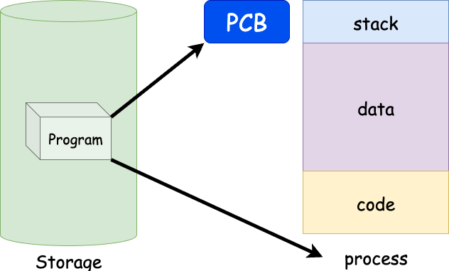

# 프로세스 란?

**프로세스(Process)란** 간단히 말해 **'실행 중인 프로그램'** 이다.  
하드 디스크에 있던 **프로그램 코드**가 *메모리에 올라와 OS의 관리하에 들어간 상태*를 의미한다.

OS(Operating Systems)는 각 프로세스를 **독립된 개체로 취급**하며, 자원을 할당하는 기본 단위로 삼는다.  
마치 각자 자기 집과 살림살이를 가진 독립된 가구와 같이 OS는 이 '가구'들을 관리하기 위해 **프로세스 제어 블록(PCB, Process Control Block)** 이라는 명찰을 만들어 모든 정보를 기록하고 제어한다

# PCB (Process Control Block)

OS의 관점에서 프로세스는 단순히 실행되고 있는 코드가 아닌 **관리해야할 상태 정보의 집합체**이다. 이런 프로세스의 상태 정보를 **Process Metadata**라고 한다.

> ### Process Metadata
>
> - **Process ID(PID)** : 운영체제가 각 프로세스를 구별하기 위해 부여하는 **고유한 번호**
> - **Process State** : 프로세스가 현재 어떤 작업을 하고 있는지 나타내는 상태 정보
> - **Process Priority** : 여러 프로세스가 동시에 CPU를 사용하려고 할 때, **누가 먼저 CPU를 사용할지 결정하는 순위**
> - **CPU Registers** : CPU 내부에 있는 매우 빠른 임시 저장 공간
> - **Owner** : **프로세스를 시작한 사용자 계정**을 의미
> - **CPU Usage** : 특정 프로세스가 현재 **CPU의 처리 능력을 얼마나 사용하고 있는지**를 백분율(%)로 나타낸 값
> - **Memeory Usage** : 프로세스가 실행되기 위해 **주기억장치(RAM)를 얼마나 차지하고 있는지** 나타내는 값

이런 프로세스 메타데이터를 관리하기 위해서 OS는 프로세스가 담고 있는 정보를 PCB 라는 자료 구조에 담아 프로세스를 파악하고 관리하게 된다.

정리하자면 1) **프로그램이 실행돼 메모리에 적재**됐을 때, 프로세스가 생겨나고 2) 프로세스 주소 공간 안에 **stack & data & code의 공간**이 생기게 된다. 이후 해당 3) 프로세스의 **메타데이터가 PCB에 저장돼 관리**된다.

## 그렇다면 왜 PCB가 필요할까?

이전에 OS에 대한 내용을 정리하면서 **인터럽트(Interrupt)** 에 대해서 설명한 적이 있다.

> ### 인터럽트란?
>
> CPU의 정상적인 실행 흐름을 방해하는 신호로, '외부에서 온 호출'이라고 할 수 있다.  
> 예를 들어, 사용자가 키보드를 누르거나, 네트워크 카드가 데이터를 수신했을 때 하드웨어는 CPU에 인터럽트를 보내 "나 좀 봐줘!"라고 알린다. 집에서 설거지하고 있는데 누군가 초인종을 누르는 것과 같다.  
> 이때 하던 일을 잠시 멈추고 문을 열어보는 것처럼, **CPU는 현재 작업을 멈추고 인터럽트 처리 루틴을 실행한다.**

CPU는 프로세스의 상태에 따라서 프로세스 교체작업이 이뤄지는데 어떤 프로세스에서 인터럽트가 발생하게 된다면 현재 진행중이던 프로세스는 대기 상태가 되고 이후에 인터럽트가 발생한 프로세스가 실행상태가 될텐데,  
**만약 지금 대기 상태가 된 프로세스의 상태 정보를 모른다면 다음에 실행 될 때 ***다시 처음부터 실행해야한다.*****

이럴 때 대기상태에 들어가기 전에 프로세스의 실행정보를 저장해 둔다면 다시 실행될 때 그대로 실행할 수 있을 것이다.
